# Ascension Chinese Patch — System Design

- 中文：[architecture.zh.md](architecture.zh.md)
- Scope: Steam *Ascension: Deckbuilding Game* (Playdek), repo `ascension-zh-cn`
- Engine: Unity **6000.0.58f2**, **IL2CPP**
- Purpose: architecture, technology choices, runtime/offline principles, data flow, constraints, and quality gates (with Mermaid diagrams)

See also: [progress.md](progress.md) · [GLOSSARY.md](GLOSSARY.md) · [feasibility-report.md](feasibility-report.md)

When this file and the Chinese copy disagree, prefer the Chinese copy for product terminology; prefer this file for neutral technical wording if they drift—keep them in sync on edits.

---

## 1. Goals and non-goals

### 1.1 Goals

| Goal | Notes |
| --- | --- |
| Playable Simplified Chinese | Menus, card names/effects, tutorial, rulebook text blocks, DLC store copy |
| External, toggleable | Installer can apply or restore English without a permanent one-way hijack |
| Consistent terminology | `glossary/zh-Hans.csv` is SSOT; prefer official/community Ascension Chinese |
| Maintainable + regression-safe | Inventory-driven coverage; pytest + CI |
| Legal fan pack | Ship tables, tools, font notes, toggler—not the game, card art, or scanned rulebooks |

### 1.2 Non-goals

- Redrawing bitmap titles / rulebook scan pages
- Changing Lua `card_name` (internal IDs)
- Full Traditional Chinese productization (OpenCC + manual keywords later)
- Relying solely on the empty stock **CH** language column (future convergence option)

---

## 2. Where game text lives

| Source | Location | Shape | Hook |
| --- | --- | --- | --- |
| Card face strings | `resources.assets` → `cards_EN` | CSV TextAsset + TMP | Offline blob + `GetTextByKey` |
| UI / common | Loc JSON / sheets (`CH` empty upstream) | Keys | Offline + overlay Keys |
| Tutorial | `tutorial_EN` | CSV | External CSV; do not break CLICK/link hit-tests |
| Codex / effects | `StreamingAssets/Lua/*_cards.lua` | `effect_text` / `flavor_text` | Offline rewrite; never touch `card_name` |
| Hardcoded UI | Prefabs / direct TMP assigns | English literals | Runtime Exact |
| Rulebooks | Rulebook* TMP + bitmaps | Text vs art | Exact / long dump; bitmaps waived |
| Menu chips | `level1` | Length-prefixed UTF-8 | Same-byte-length replace |

Card faces use overlay text (often English drop-caps via `<size=…>`), not baked English in art.

### 2.1 Text sources and hooks

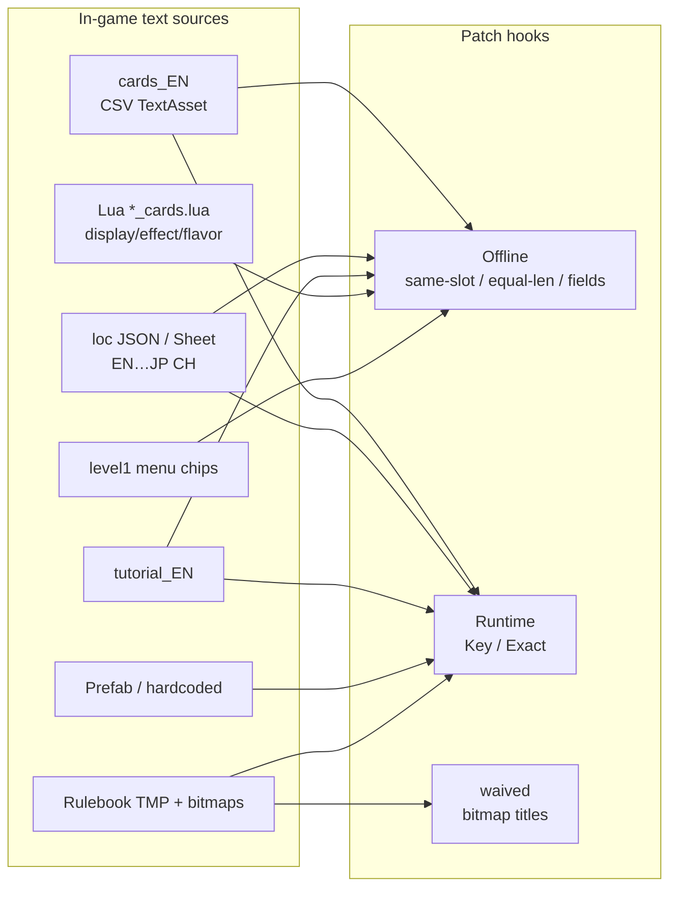

---

## 3. Architecture overview

Hybrid: **restorable offline file patches** + **BepInEx runtime overlay**.

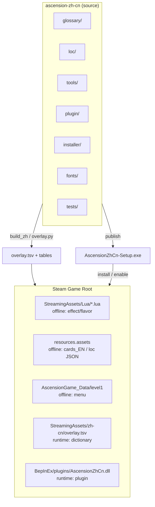

ASCII (plain-text environments):

```text
ascension-zh-cn  --build-->  overlay.tsv + tables
                 --install--> Steam tree:
                   Lua / resources.assets / level1   (offline)
                   StreamingAssets/zh-cn/overlay.tsv (runtime data)
                   BepInEx/plugins/AscensionZhCn.dll (runtime)
```

| Layer | When | Components | Role |
| --- | --- | --- | --- |
| Offline | Installer | Lua / Asset / Scene patchers | Durable display fields with backups |
| Lexicon build | Dev | glossary → overlay.py | `overlay.tsv` (`K` + `E` rows) |
| Runtime | Every launch | BepInEx 6 IL2CPP plugin | Loc hooks, Exact rewrite, CJK TMP fallback |

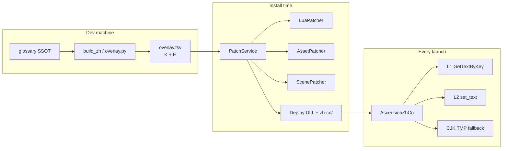

Disable = restore backups + remove plugin / `zh-cn` (keep `state/backups`).

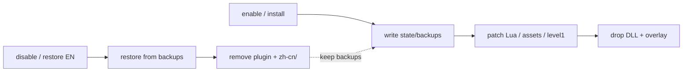

---

## 4. Technology choices

| Concern | Choice | Why |
| --- | --- | --- |
| Injection | BepInEx 6 Unity IL2CPP | Works on this Unity 6 build |
| UI rewrite | Harmony postfix `GetTextByKey` + prefix TMP/UI `set_text` | Keys + hardcoded English |
| Fonts | Runtime TMP fallback (YaHei / SimHei / optional TTF) | Baking fonts into assets crashed historically |
| Terms | Glossary CSV SSOT | Reviewable; derives case / faction×type |
| Delivery | WinForms setup + payload | One-click; admin when under Program Files |
| Long rulebook/DLC | Exact + paragraph indexes | TMP often renders one paragraph at a time |
| QA | pytest + inventory matrix | No silent coverage loss |

Rejected: irreversible tree hijack; full-scene TMP sweep every frame on rulebook (freezes); word-salad MT into main tables.

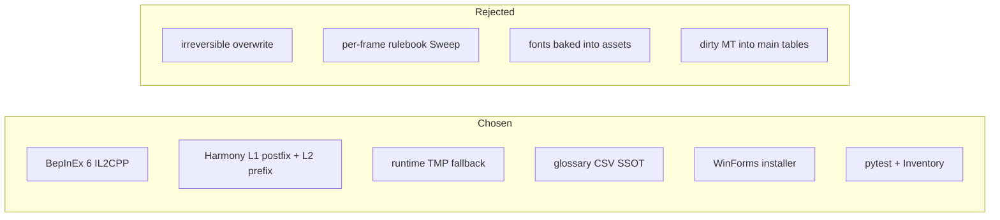

---

## 5. Runtime plugin

Plugin id `ascension.zh.cn` (`plugin/AscensionZhCn/Plugin.cs`).

**Boot:** bind dump config → load overlay → patch L1 immediately → try sync CJK → if ready, arm L2 setters + `sceneLoaded` → inject `CjkFontBehaviour` (retries, periodic relocalize, per-frame state markers).

```mermaid
sequenceDiagram
  participant P as AscensionZhCn
  participant O as overlay.tsv
  participant L as LocalizationService
  participant T as TMP / UI.Text
  participant F as CJK Fallback

  P->>P: bind Dump* config
  P->>O: LoadOverlay()
  O-->>P: Keys + Exact + indexes
  P->>L: PatchLocalization() L1 immediately
  P->>F: EnsureCjkFallback()
  alt font ready
    P->>P: _ready = true
    P->>T: PatchTextSetters() L2
    P->>P: sceneLoaded + CjkFontBehaviour
  else font not ready
    P->>P: L1 only; Behaviour retries font
  end
```

**L1:** postfix `GetTextByKey` → `Keys`. Prefer keys for card faces; avoid duplicate Exact for those strings.

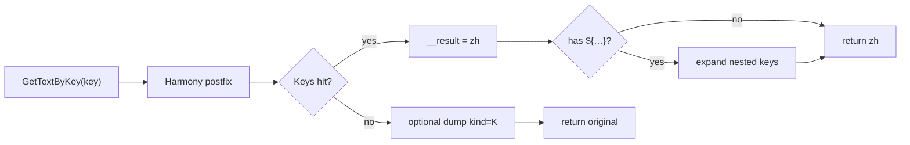

**L2:** prefix `set_text` / `SetText` → Exact / normalized / prefix / sentence / contains. Skip tutorial CLICK/link. Re-entrancy guard `_inRewrite`. No word-level MT on rulebook-like text.

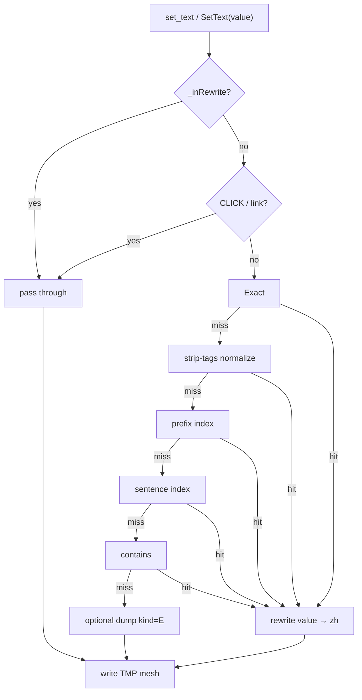

**State markers:** show Chinese, cache English for `get_text`, LateUpdate force—may cost one English frame, avoids logic oscillation.

```mermaid
sequenceDiagram
  participant Game as Game logic
  participant TMP as TMP
  participant Plug as Plugin

  Game->>TMP: set_text("Play Your Turn")
  Plug->>TMP: show Chinese; cache English
  Game->>TMP: get_text()
  Plug-->>Game: cached English (logic compare)
  Note over TMP: possible one English frame
  Plug->>TMP: LateUpdate force Chinese
```

**Fonts:** create TMP fallback from OS or packaged TTF; attach to TMP settings and live fonts. Chinese from L1 without fallback = tofu flash.

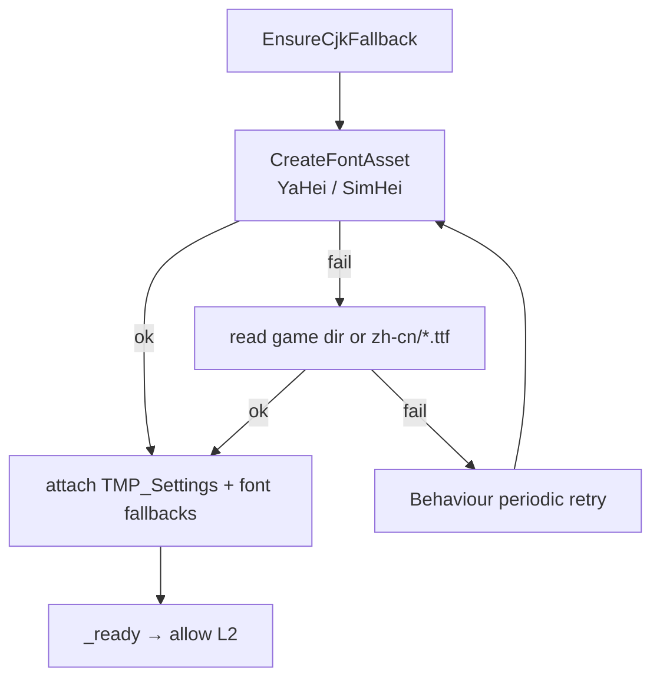

**Dump:** `untranslated.tsv` kinds `K`/`E`/`L`; ingest carefully (filter noise).

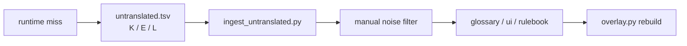

---

## 6. Offline installer

`PatchService`: Lua fields → assets (`cards_EN`, padded loc JSON; skip overlong / hint / tutorial keys) → same-length `level1` → deploy BepInEx + overlay. Steam verify integrity undoes offline layer.

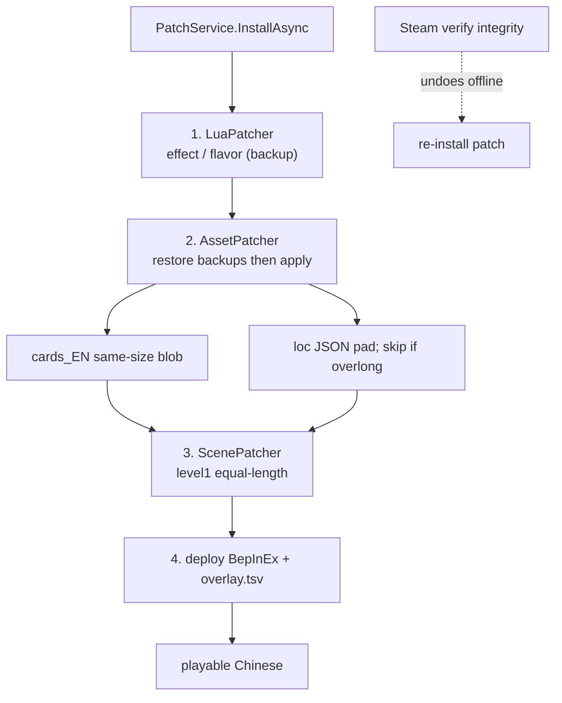

---

## 7. Lexicon pipeline

1. Edit `glossary/zh-Hans.csv` (approved only ships)
2. `glossary_gen.py` / `build_zh.py` / `overlay.py` → `overlay.tsv`
3. Rulebook human dict: `translate_rulebook.py` → `rulebook.csv`
4. Enable copies overlay next to the game

Row types: `K\tkey\tzh`, `E\ten\tzh` (empty zh = placeholder; not for release).

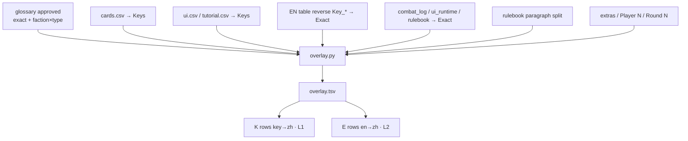

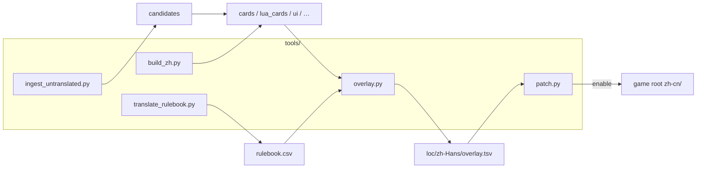

---

## 8. Repo layout

`glossary/`, `loc/{en,zh-Hans,inventory}/`, `plugin/`, `installer/`, `tools/`, `tests/`, `fonts/`, `docs/`, `state/backups/`, `patch.json`.

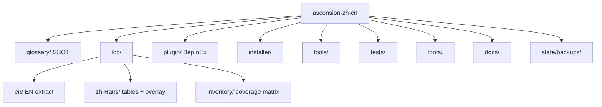

In-game: `StreamingAssets/zh-cn/`, `BepInEx/plugins/`, `BepInEx/config/ascension.zh.cn.cfg`.

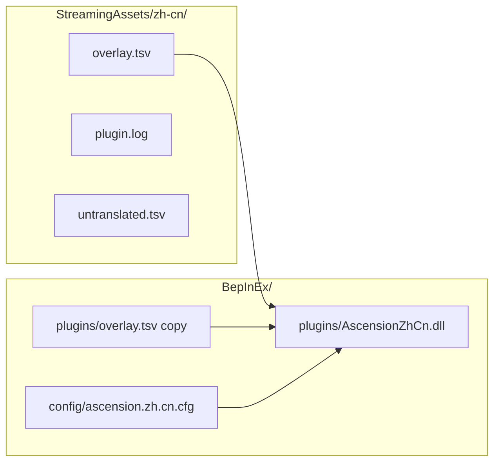

---

## 9. Structural limitations

Flicker (post-hoc rewrite), empty rulebook shells until applied, MT pollution, multi-path inconsistency, equal-length skips, waived bitmaps. Remediation is inventory + tests + phased coverage/quality/UX work.

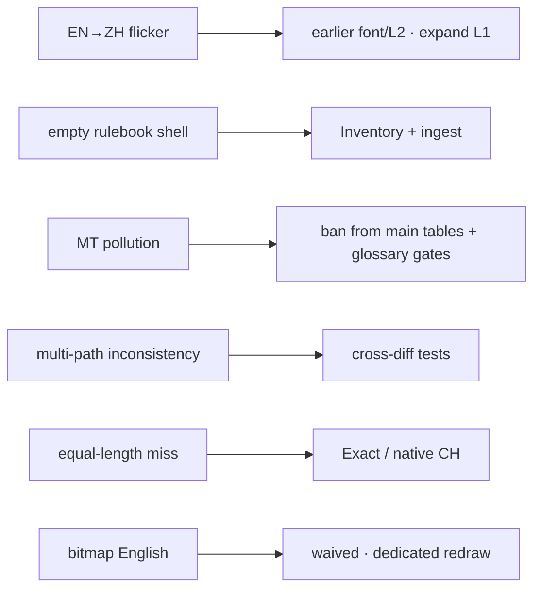

---

## 10. Quality: tests and inventory

Layers L0–L6 (build invariants → coverage → glossary gates → pure functions → golden snapshots → install smoke → manual UX). Inventory statuses: `missing | draft | reviewed | waived`. Ship with `missing=0` in scope; waived listed with reasons.

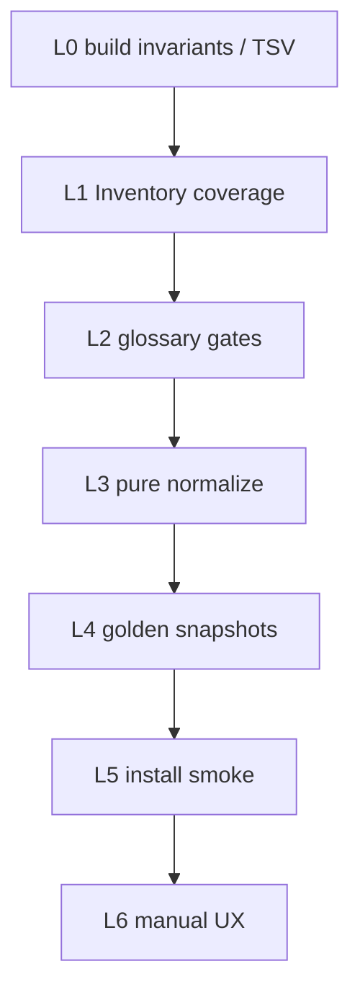

Phases: **T** harness → **0** baseline fill → **1** coverage → **2** per-set review → **3** anti-flicker.

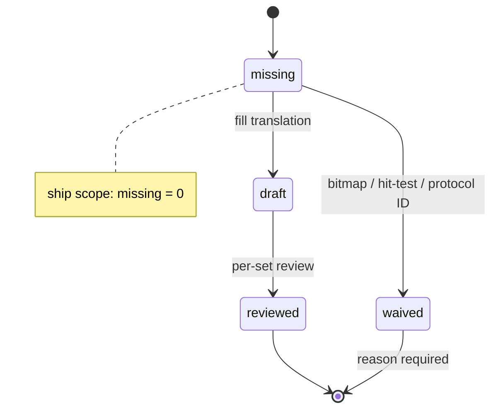

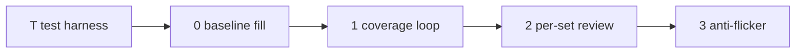

---

## 11. Compatibility

Display-only; keep `card_name`; admin may be required under Program Files; first BepInEx interop launch may need a second enable.

```mermaid
flowchart TB
  Display["display-only"] --> Safe["no win/lose / logic-table edits"]
  ID["keep card_name English"] --> Net["stable online IDs"]
  Admin["Program Files → admin"] --> Install["installer elevation prompt"]
  First["first BepInEx interop"] --> Second["may need second enable"]
```

---

## 12. Changelog

| Date | Notes |
| --- | --- |
| 2026-08-22 | Add Mermaid diagrams (sources, overview, layers, enable/disable, runtime L1/L2/markers/fonts, offline install, lexicon, layout, defects, tests/Inventory) |
| 2026-08-22 | Initial system design (EN companion to architecture.zh.md) |
