# 《创升纪元》汉化补丁系统设计

- English: [architecture.md](architecture.md)
- 适用范围：Steam 版 *Ascension: Deckbuilding Game*（Playdek），补丁仓库 `ascension-zh-cn`
- 游戏引擎：Unity **6000.0.58f2**，**IL2CPP**
- 文档目的：说明整体架构、技术选型、运行原理、数据流、约束与演进原则，供维护与回归测试对照；文中含 Mermaid 架构图

相关文档：[进度](progress.zh.md) · [术语表维护](GLOSSARY.zh.md) · [可行性报告](feasibility-report.zh.md) · [科普博文](blog-why-chinese.zh.md)

---

## 1. 目标与非目标

### 1.1 目标

| 目标 | 说明 |
| --- | --- |
| 可玩的简体中文 | 菜单、卡名、效果、教程、规则书文字段、DLC 商店文案等显示层中文 |
| 外置可开关 | 不永久破坏原版；安装器可「安装汉化 / 恢复英文」 |
| 术语一致 | 以 `glossary/zh-Hans.csv` 为唯一事实来源（SSOT），对齐《暗杀神》/《创升纪元》主流译法 |
| 可维护可回归 | Inventory 无遗漏推进；pytest + CI 防止修一处坏一处 |
| 合法粉丝包 | 只分发译表、工具、字体授权说明与开关器；不分发游戏本体 / 卡图 / 规则书扫描件 |

### 1.2 非目标（刻意不做或延后）

- 重绘卡面艺术字、规则书位图扫描页、扩展缩写图标等 **纹理标题**
- 修改 Lua `card_name`（内部 ID，联机/逻辑依赖）
- 语音、繁体完整产品化（繁体可用 OpenCC 派生，但需关键字人工）
- 依赖玩家在空白官方 **CH** 语言项里「点一下就完事」（见 §5；可作为未来收敛方向）

---

## 2. 游戏侧文本来源（为什么能汉化）

游戏本身带本地化管线，比多数 IL2CPP 游戏更有利：

| 来源 | 位置 | 形态 | 汉化切入点 |
| --- | --- | --- | --- |
| 卡面展示串 | `resources.assets` → `cards_EN` | CSV TextAsset；TMP 富文本叠在卡图上 | 离线同槽替换 + runtime `GetTextByKey` |
| UI / 通用串 | Google Sheet 缓存 / loc JSON；列含 `EN … JP CH` | `CH` 列预留但原版为空 | 离线填键 + overlay Keys |
| 教程 | `tutorial_EN` 等 | CSV | 外置 `tutorial.csv`；**禁止**把中文写进 tutorial 热区依赖串 |
| 图鉴 / 部分效果 | `StreamingAssets/Lua/*_cards.lua` | `display_name` / `effect_text` / `flavor_text` | 安装时改写；**永不改** `card_name` |
| 硬编码 UI | Prefab / 代码直接 `tmp.text = "…"` | 英文直写 | runtime Exact 匹配 |
| 规则书 | Rulebook* prefab 的 TMP + 扫描位图 | 文字段可钩；扫描页是图 | Exact / 长文 dump；位图 waived |
| 主菜单碎片 | `AscensionGame_Data/level1` | 长度前缀 UTF-8 | 等长字节替换（中文变长则跳过） |

卡面不是「英文烤在图上」，而是 `CARDNAME_*` / `EFFECT_*` 动态叠字（常见英文首字母 `<size=104>V</size>oid…`）。中文排版应取消首字母放大，整词显示。

### 2.1 文本来源与切入点

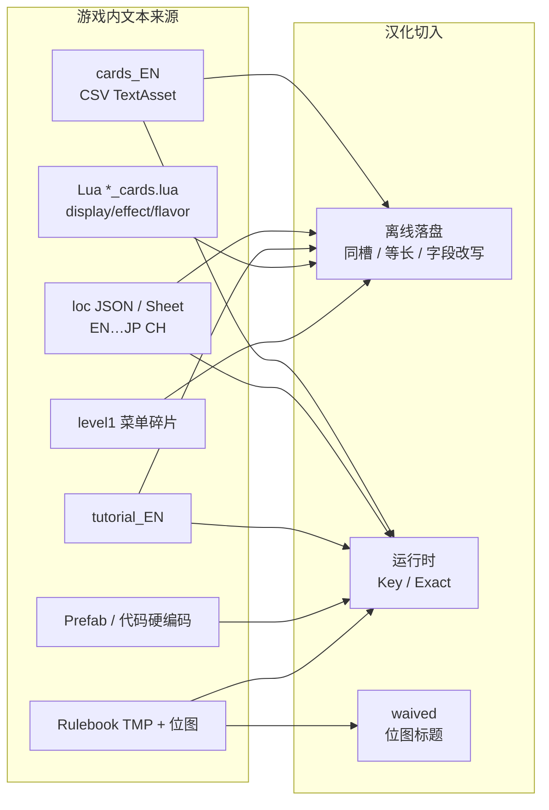

---

## 3. 总体架构

补丁是 **混合方案**：安装期改磁盘上的可还原数据 + 运行期 BepInEx 注入显示层。

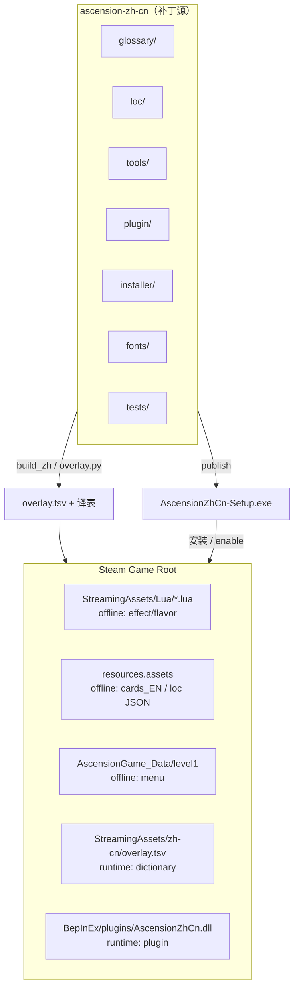

ASCII 对照（便于纯文本环境）：

```text
┌─────────────────────────────────────────────────────────────────┐
│  ascension-zh-cn（补丁源）                                       │
│  glossary/  loc/  tools/  plugin/  installer/  fonts/  tests/   │
└────────────┬───────────────────────────────┬────────────────────┘
             │ build_zh / overlay.py         │ publish installer
             ▼                               ▼
      overlay.tsv + 译表              AscensionZhCn-Setup.exe
             │                               │
             │                               │         （安装 / enable）
             ▼                               ▼
┌─────────────────────────── Steam Game Root ────────────────────────┐
│  StreamingAssets/Lua/*.lua          ← offline: effect/flavor       │
│  resources.assets                   ← offline: cards_EN / loc JSON │
│  AscensionGame_Data/level1          ← offline: menu                │
│  StreamingAssets/zh-cn/overlay.tsv  ← runtime: dictionary          │
│  BepInEx/plugins/AscensionZhCn.dll  ← runtime: plugin              │
└────────────────────────────────────────────────────────────────────┘
```

### 3.1 三层协作

| 层 | 何时 | 组件 | 职责 |
| --- | --- | --- | --- |
| **离线补丁** | 安装器 `PatchService.InstallAsync` | `LuaPatcher` / `AssetPatcher` / `ScenePatcher` | 把能安全落盘的中文写进游戏文件（带备份） |
| **词库构建** | 开发机 `python tools/build_zh.py` | `glossary_gen` → `overlay.py` | 生成 `loc/zh-Hans/overlay.tsv`（K 键 + E 精确串） |
| **运行时** | 每次启动 | `AscensionZhCn` BepInEx 6 IL2CPP 插件 | Hook 取词 / 设字；挂 CJK TMP 回退字体 |

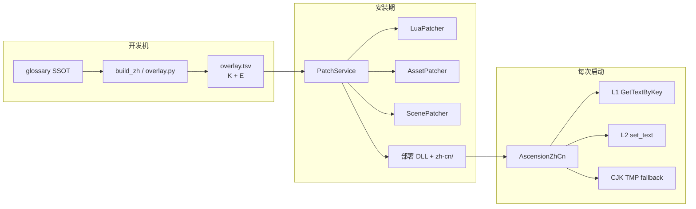

关闭汉化：安装器 **恢复** Lua/assets/level1 备份，并移除 BepInEx 插件与 `zh-cn` 目录（保留 `state/backups` 便于再装）。

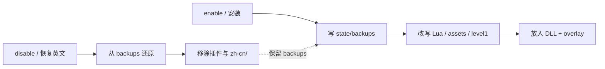

---

## 4. 技术选型与理由

| 选型 | 选择 | 理由 |
| --- | --- | --- |
| 注入框架 | **BepInEx 6 Unity IL2CPP** | Unity 6 + IL2CPP 下可稳定加载；Harmony 可打托管互操作层 |
| UI 改写 | Harmony **postfix** `LocalizationService.GetTextByKey` + **prefix** `TMP_Text`/`UI.Text` `set_text` | 游戏已有 loc 键；硬编码串只能在赋值前改写 |
| 字体 | 运行时 TMP **fallback**（雅黑 / 黑体 / 可选 `cjk-overlay.ttf`） | 禁止往 `resources.assets` 塞字库（曾导致越界崩溃） |
| 术语 | CSV glossary SSOT | 人工可审；构建可推导大小写与派系组合 |
| 交付 | WinForms 安装器 + `payload` | 玩家一键；Program Files 可提示管理员 |
| 规则书长文 | Exact 整段匹配 + 段落切分索引 | 位图不改；TMP 常按段渲染，需 prefix/sentence 索引 |
| 测试 | **pytest** 门禁 + Inventory 矩阵 | 防回归、防遗漏（见 §10） |

**明确拒绝的路径：**

- 永久覆盖安装树且无法还原
- Harmony 乱改导致白屏的危险实验（历史文档曾警告勿改 `set_text`；当前 1.4.x **有条件地** prefix，并靠重入守卫与规则书禁用全量 Sweep 控风险）
- 对规则书场景每帧 `FindObjectsOfTypeAll`（曾卡死）

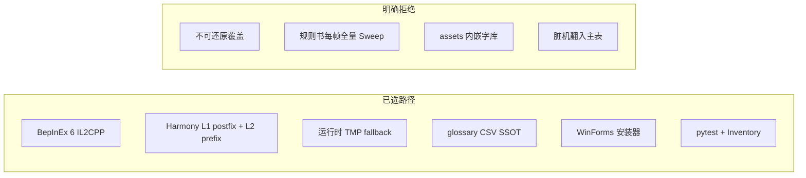

---

## 5. 运行时原理（插件）

插件 ID：`ascension.zh.cn`（见 `plugin/AscensionZhCn/Plugin.cs`）。

### 5.1 启动顺序

1. 绑定配置：`DumpUntranslated` / `DumpLongStrings`
2. `LoadOverlay()`：读 `StreamingAssets/zh-cn/overlay.tsv`（或 plugins 旁路）→ `Keys` + `Exact`（及 Normalized / Prefix / Sentence / Contains 索引）
3. `PatchLocalization()`：**立刻**挂 L1（即使字体未就绪）
4. 尝试同步 `EnsureCjkFallback()`；成功则 `_ready`，再 `PatchTextSetters()`（L2）+ `sceneLoaded`
5. 注入 `CjkFontBehaviour`：字体重试、周期性 `RelocalizeUi`、每帧 `ForceStateMarkersToChinese`

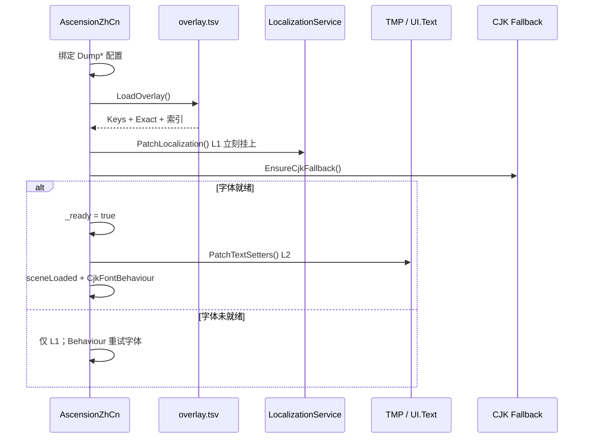

### 5.2 L1：按 Key 替换

- Harmony **postfix** `GetTextByKey`
- 命中 `Keys[key]` 则改 `__result`
- 支持 `${…}` 内嵌键再展开（调用游戏自带 Convert 方法，若可反射到）
- 未命中可 dump 为 kind `K`

卡面名/效果优先走 loc 键；overlay 构建时 **避免** 再为卡名做 Exact，防止与 L1 叠第二层。

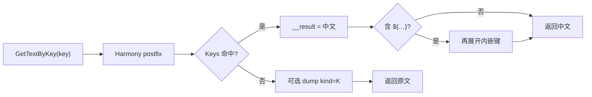

### 5.3 L2：按英文字面替换

- Harmony **prefix** `TMP_Text.set_text` / `SetText`、`UI.Text`、`TextMesh`
- 在写入网格前把 `ref string value` 改成中文
- 查找链（概念上）：Exact → 去标签归一化 → 前缀索引 → 句子索引 → contains →（规则书类禁用逐词机翻）
- 教程保护：含 `CLICK` / `<link>` 等不改，避免点选失效
- 重入守卫 `_inRewrite`：防止改写触发布局再入死循环

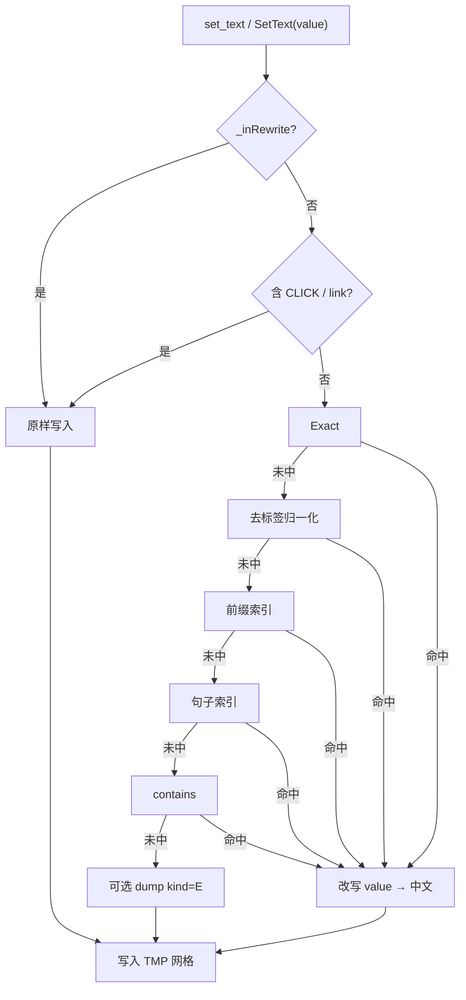

### 5.4 状态标记（回合提示）

游戏每帧用英文状态串做逻辑比较（如 `Play Your Turn` / `End Turn`）。策略：

- 显示层写成中文，并按实例缓存原文
- `get_text` postfix 对逻辑读回返回英文
- `LateUpdate` 再强制显示中文

代价：可能出现 **一帧英文**；换取逻辑不振荡。这是「先英后中」闪烁的原因之一。

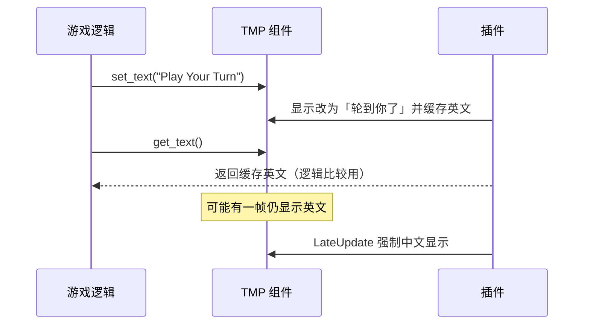

### 5.5 字体

1. `TMP_FontAsset.CreateFontAsset` 系统雅黑 / 黑体
2. 否则读游戏目录或 `StreamingAssets/zh-cn` 下 TTF
3. 挂到 `TMP_Settings.fallbackFontAssets` 与各 TMP 字体的 fallback 表
4. 传统 `UI.Text` 可用 `Font.CreateDynamicFontFromOSFont`

L1 已出中文但字体未挂 → **方框闪（tofu）**；故强调同步安装字体后再宣称 `_ready`。

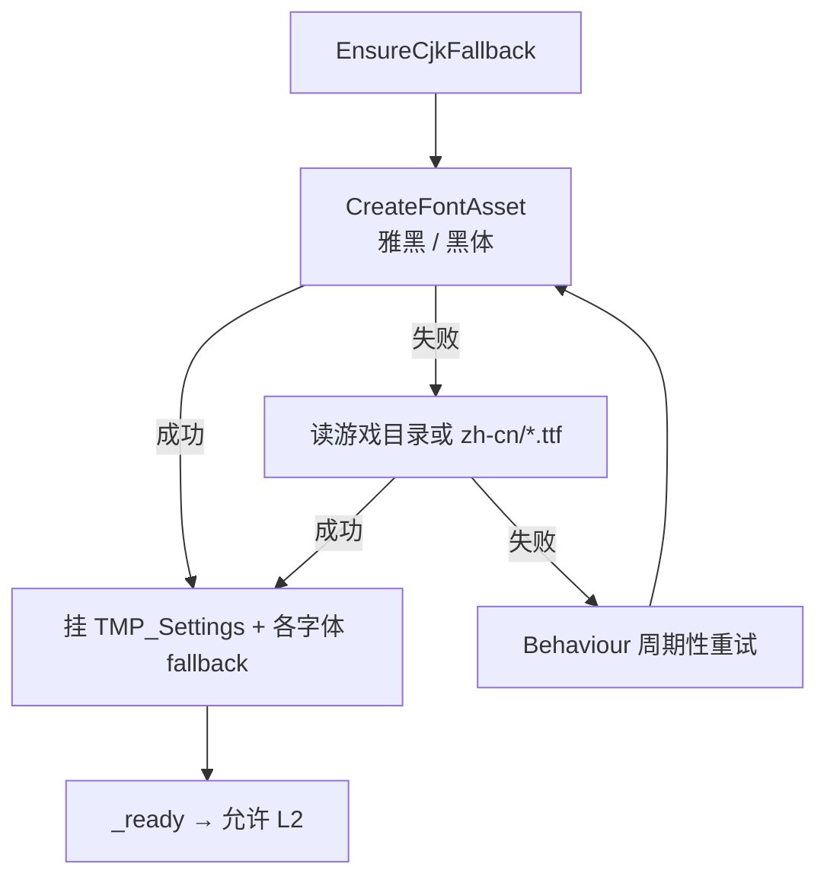

### 5.6 漏译采集

未匹配英文可写入 `StreamingAssets/zh-cn/untranslated.tsv`（kind `K`/`E`/`L`）。长文与 `<sprite>` 在 `DumpLongStrings=true` 时可采。采集后应 `ingest_untranslated.py` **人工/术语表**入库，禁止把噪声碎片当译文。


---

## 6. 离线补丁原理（安装器）

入口：`installer/.../PatchService.cs`（GUI `MainForm` 或 CLI）。

推荐顺序：

1. **Lua**：按 `lua_cards.csv` / combat log 等改写 `effect_text`、`flavor_text`（及格式串）；备份原文件
2. **Assets**：从备份还原 `resources.assets` 再应用，避免叠脏
   - `cards_EN` 同尺寸 blob
   - loc JSON：UTF-8 **垫到原长度**；中文更长则 **跳过该键**（依赖 runtime）
   - 跳过 `Key_Hint_*`、`TUTORIAL_*` 等策略性键
3. **Scenes**：`level1` 等长替换少量菜单串
4. **BepInEx**：确保门框与插件、复制 `overlay.tsv`

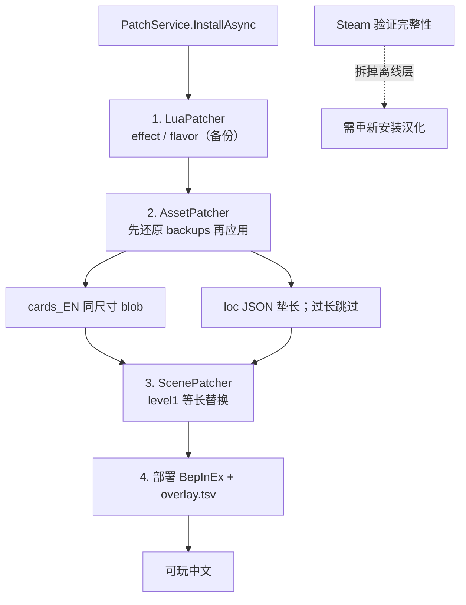

Steam「验证游戏文件完整性」会拆掉离线层；需重新安装汉化。

---

## 7. 词库与构建流水线

### 7.1 Glossary SSOT

- 文件：`glossary/zh-Hans.csv`（`en,zh,scope,source,status,notes`）
- 仅 `status=approved` 进入 overlay
- `label/login/button/shop/ui` 自动生成大小写变体
- `faction × type` 组合推导（如 Enlightened Hero → 圣贤英雄）
- 维护手册：[GLOSSARY.zh.md](GLOSSARY.zh.md)

### 7.2 Overlay 构建顺序（`tools/overlay.py`）

概念顺序（以代码为准）：

1. Glossary approved → exact / 组合
2. `cards.csv` → Keys
3. `ui.csv` / `tutorial.csv` → Keys
4. 英文表反查 Key_* → Exact
5. `combat_log.csv` / `ui_runtime.csv` / `rulebook.csv` → Exact
6. 规则书段落切分与硬编码段落图
7. 遗留 extras、`Player N` / `Round N` 模板

产物：`loc/zh-Hans/overlay.tsv`，行类型：

- `K\tkey\tzh` — L1
- `E\ten\tzh` — L2（`zh` 空表示待译占位，不应长期留在发版）

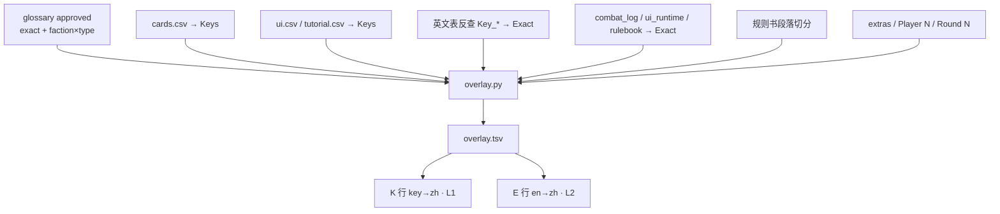

### 7.3 其它构建

- `tools/build_zh.py`：汇总 cards / lua_cards / ui / tutorial 等
- `tools/translate_rulebook.py`：人工段落字典写入 `rulebook.csv`
- `tools/ingest_untranslated.py`：dump → 候选表（长文进 rulebook 空 zh，不走脏机翻）
- `tools/patch.py enable|disable`：开发者开关

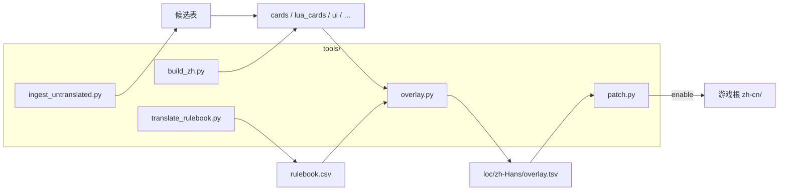

---

## 8. 目录地图

```text
ascension-zh-cn/
  glossary/           术语 SSOT
  loc/en/             英文抽取与清单
  loc/zh-Hans/        中文译表 + overlay.tsv
  loc/inventory/      覆盖矩阵（无遗漏推进）
  plugin/             BepInEx 插件源码
  installer/          安装器
  tools/              抽取 / 构建 / 审计 / 补丁脚本
  tests/              pytest 回归
  fonts/              字体说明与子集工具
  docs/               本文档与进度 / 术语指南
  state/backups/      安装备份元数据
  patch.json          enabled / locale
```

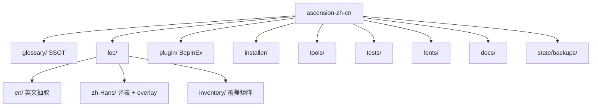

游戏内运行时旁路：

```text
AscensionGame_Data/StreamingAssets/zh-cn/   overlay.tsv, plugin.log, untranslated.tsv
BepInEx/plugins/                           AscensionZhCn.dll, overlay.tsv 副本
BepInEx/config/ascension.zh.cn.cfg         Dump* 开关
```

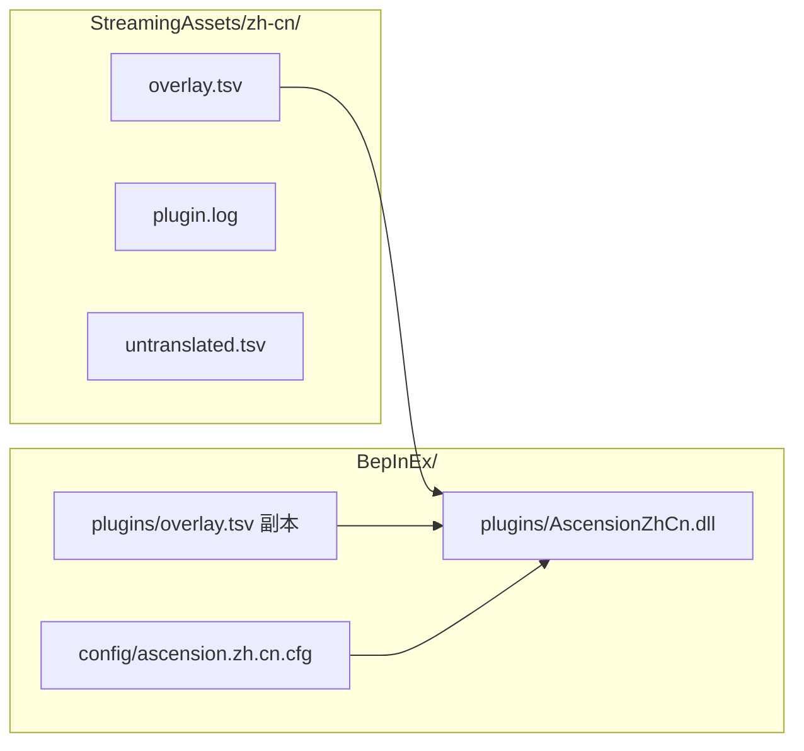

---

## 9. 已知结构性缺陷（设计层）

| 问题 | 机制原因 | 演进方向 |
| --- | --- | --- |
| 先英后中闪烁 | 事后改写 + 字体滞后 + 状态标记一帧 | 提前字体/L2；扩大 L1；评估原生 CH |
| 规则书/DLC 曾全空 | `rulebook.csv` 空壳；人工稿在 `translate_rulebook.py` 未灌入 | Inventory + 灌入 + 覆盖门禁 |
| 机翻中英夹杂 | ingest/translate_effect 历史污染；glossary 未强制回写 | 禁新机翻入主表；glossary 门禁 |
| 界面译名不一致 | L1/L2/Lua/level1 多源 | 交叉 diff 测试 |
| 等长失败永久英文 | assets/scene 槽位不够长 | 转 Exact；或未来 CH 列 |
| 位图仍英 | 纹理 | waived，专项重绘 |

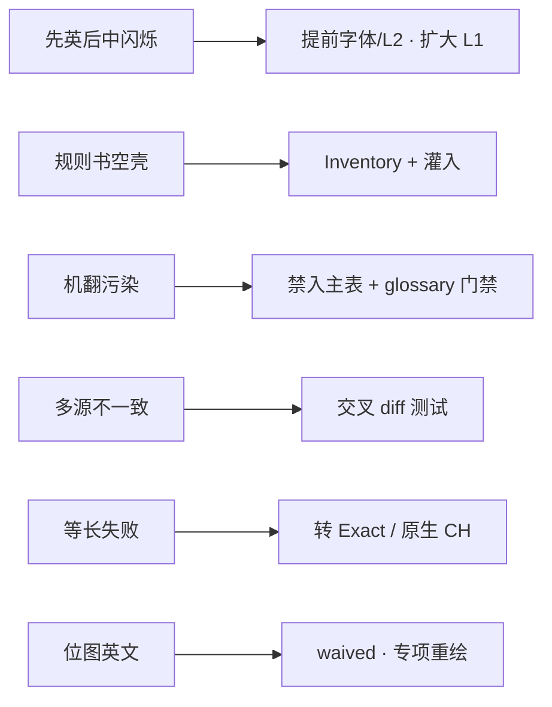

---

## 10. 质量原则：测试与无遗漏路线图

### 10.1 测试分层

| 层 | 内容 |
| --- | --- |
| L0 | overlay/构建不变量、TSV 格式 |
| L1 | Inventory 覆盖 / 空 zh 天花板 |
| L2 | glossary 禁词与必词、冲突 en |
| L3 | 归一化 / 去标签等纯函数 |
| L4 | 金样英文→中文快照 |
| L5 | 安装 enable/disable 烟雾（有游戏根时） |
| L6 | 发版前人工 UX 清单 |

本地：`pytest -q`（仓库根 `ascension-zh-cn`）。CI 同门禁。

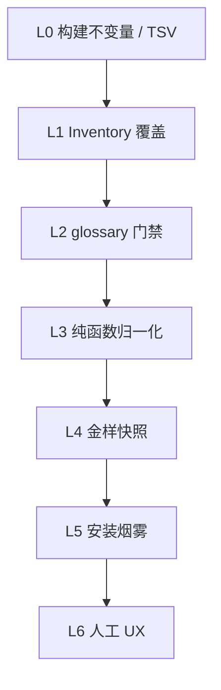

### 10.2 Inventory

- `loc/inventory/strings.csv`：每条可显示串登记
- 状态：`missing | draft | reviewed | waived`
- 发布域内 **`missing = 0`**；`waived` 必须写原因（位图、热区、协议 ID 等）
- 英文源增多而矩阵未增 → CI 失败

阶段概览：`T 测试地基 → 0 基线灌入 → 1 覆盖闭环 → 2 按包审校 → 3 消闪`。细节见 [roadmap.zh.md](roadmap.zh.md) 与 [progress.zh.md](progress.zh.md)。

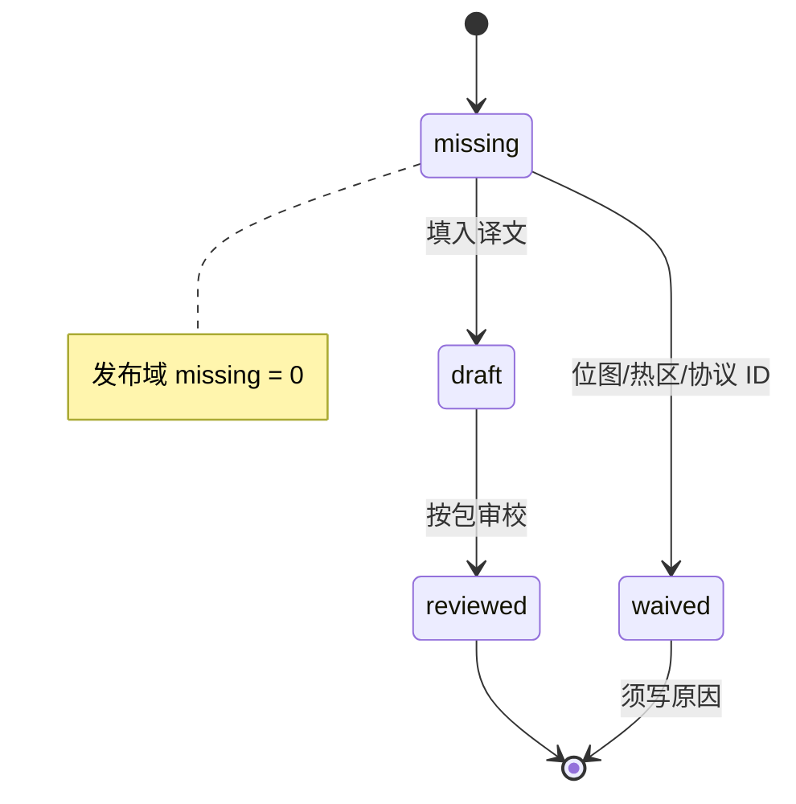


---

## 11. 安全与兼容性边界

- 只改显示；不改胜负与卡牌逻辑表结构（除展示字段）
- 联机：内部 ID 保持英文；若服务端校验展示文案需实测
- 权限：游戏在 Program Files 时安装需管理员
- 首次 BepInEx 启动可能生成 interop，中文有时需二次启用才稳定——安装器应提示

```mermaid
flowchart TB
  Display["只改显示层"] --> Safe["不改胜负 / 逻辑表结构"]
  ID["card_name 保持英文"] --> Net["联机 ID 稳定"]
  Admin["Program Files → 需管理员"] --> Install["安装器提权提示"]
  First["首次 BepInEx interop"] --> Second["可能需二次 enable"]
```

---

## 12. 变更记录

| 日期 | 说明 |
| --- | --- |
| 2026-08-22 | 阶段细节指向 `roadmap.zh.md`；Phase T/0 完成后进入 Phase 1 |
| 2026-08-22 | 补充 Mermaid 架构图：文本来源、总览、三层协作、启停、运行时 L1/L2/状态标记/字体、离线安装、词库流、目录、缺陷演进、测试与 Inventory |
| 2026-08-22 | 首版系统设计文档：混合架构、选型、运行/离线原理、词库流、缺陷与测试原则 |
