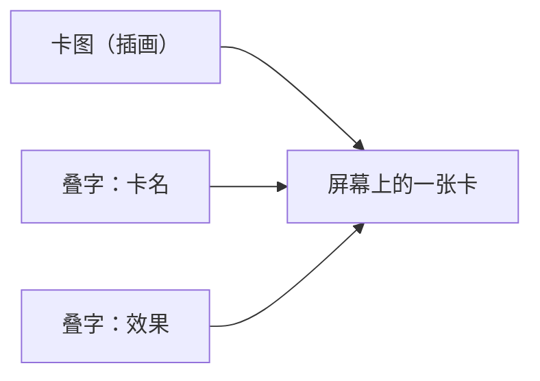
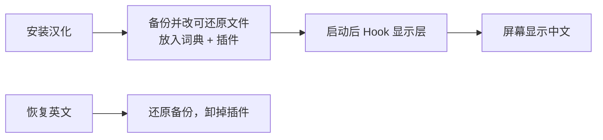
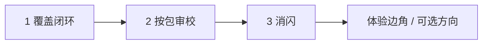

# 为什么《Ascension》能做成中文？

Steam 上的 *Ascension: Deckbuilding Game*，官方界面只有英语。它在中文玩家嘴里有两个名字：早年方盒子引进时的 **《暗杀神》**，以及后来系列更常用的 **《创升纪元》**。这两套译名都会出现在术语里；补丁对外也常写作「《创升纪元》（又名《暗杀神》）中文语言包」。

先把身份说清楚：这是**粉丝做的外置、可开关语言包**，不是官方中文版，也不是 Steam 上的官方语言 DLC。能玩中文，靠的是游戏自身的文本结构刚好「好下手」——下面用尽量少的行话讲清楚原理、边界，以及接下来要干什么。

（工程细账见 [系统设计](architecture.zh.md)；进度见 [progress.zh.md](progress.zh.md)。）

---

## 关键的误解：卡面上的英文是「画」上去的吗？

很多卡牌游戏的标题是艺术字烤进贴图的。那种情况粉丝几乎只能重绘，版权和工期都另一回事。

《Ascension》多数卡面不是这样。插画是一层图；**卡名、效果是 TextMeshPro 在运行时叠上去的字**——英文里还常见把首字母单独放大。你看见的「一张卡」，其实是图 + 字叠在一起：

所以汉化改的是「叠上去的那串字」，不必重画整张卡。规则书里也有类似分野：能钩的是**文字段**；整页扫描的位图，目前刻意不做。

另一件对粉丝友好的事：游戏本来就有本地化管线（按 Key 取文案），语言表里甚至留了 **CH 列**——可惜整列是空的，也没有现成的中文字体。空列不等于「点一下就有中文」；它只说明上游曾经考虑过中文槽位，而真正可用的中文，还得自己接词库和字体。

字并不是只住在一个文件里。有的在资源表（卡面 CSV），有的在 Lua 展示字段（图鉴效果/风味），有的是界面里写死的英文，还有一点点藏在主菜单场景数据里。补丁要分别对付；但有一条红线始终不变：**Lua 里的 `card_name` 是内部 ID，联机和逻辑会用到——只改给人看的文案，绝不改 ID。**

---

## 实际怎么做：一半写进磁盘，一半在运行时改写

可以把它想成两道工序。

**离线（安装时）**：把能安全改、又能备份还原的展示内容写进游戏目录——例如 Lua 里的效果/风味、部分资源表、少量主菜单字符串。Steam「验证游戏文件完整性」会拆掉这一层，所以需要再装一次汉化；这是「可还原」的代价，也是刻意不做永久劫持安装树的原因。

**运行时（每次启动）**：用 BepInEx 加载一个小插件。游戏按 Key 取文案时，有中文就换成中文；遇到写死在代码里的英文，在画到屏幕前用对照表替换。与此同时挂上中文 TMP 回退字体——原版几乎只有拉丁字形，词库对了却没字体，你看到的会是一排「口口口」。

术语则单独维护一张表（`glossary`），审过的词才进入发布用的词典。目标很土也很重要：不要让「Rune」这一局叫符文、下一局叫符石。

运行时还有个小副作用值得坦白：有些回合提示，游戏逻辑每帧用**英文**做比较。插件往往「给人看中文、给逻辑读回英文」，偶尔会先闪一帧英文，或字体晚半拍时闪一下方框。这是已知体验债，后面会专门消，不是已经消失。

---

## 能做到什么，做不到什么

边界比原理更重要——尤其是对「能不能上 Steam」「是不是官方中文」这类期望。

### 能做到的

对局和菜单里，**显示层**的简体中文：卡名、效果、大部分 UI、教程文案、规则书文字段、DLC 商店长文等。安装器可以**一键开/关**：装上中文，或恢复英文。译名优先跟《暗杀神》/《创升纪元》的主流口径走，缺口再按同一套术语补。译表和工具开源，你可以反馈，也可以自己改词后重建。

它改的是「你这台机器上看见的字」，不改胜负规则，也不把别人的客户端变成中文。

### 做不到的（或刻意不做）

**不能当成官方语言 Mod 发到 Steam。**  
这不是 Playdek 的官方本地化，也不是「创意工坊一键订阅的官方中文」。粉丝包通常以 GitHub Release + 安装器的形式分发；不能把游戏本体打包装进工坊冒充语言包，更不能在商店页写成官方支持语言。想要的是「本机可玩的中文」，不是「Steam 语言下拉里多出一个由 Valve/厂商背书的选项」。

**不能指望点游戏里空白的 CH 就完事。**  
列在，词不在，字体也不在。补丁必须自带词典、字体和开关。

**不能在「验证游戏文件」之后仍永久汉化。**  
验证会拆掉离线改动；再开一次安装器即可。我们宁可可还原，也不做单向破坏安装目录。

**不能（当前也不做）重绘贴图式标题。**  
例如部分 Logo、规则书扫描页——那是图，不是叠字；工期和版权边界都不同，清单里标成 waived。

**不能附带正版游戏、卡图或扫描规则书。**  
公开分发的只有译表、工具、字体授权说明和开关器。

**不能承诺开箱零闪烁、零遗漏。**  
大部分可玩中文 ≠ 每一处都已人工审过；机翻残留和闪烁仍在治理清单上。

**不做完整繁体产品化**（可转换再人工收关键字，但是后话）；**也不保证联机对面看到中文**——只影响本机显示。

一句话：**我们能改「你看见的字」；不能变成官方发行方，也不能保证屏幕上每一个英文字素都消失。**

---

## 现在走到哪，接下来做什么

**现在**：菜单和对局大部分已经能用中文玩；规则书文字段和商店长文已进译表；仍有待审的机翻、个别遗漏，以及上面说的闪烁。

**接下来**三条主线，故意排了优先级：

1. **覆盖闭环** — 用 Inventory 盯住「还有哪些可显示串没着落」，把发布域里的缺口清掉，并挡住脏机翻再进主表。  
2. **按扩展审校** — 一包一包把草稿推到审定，强制统一历史口径（派系名、关键字不要来回变）。  
3. **消闪** — 让中文字体更早就绪，尽量走 Key 而少做事后改写，打开菜单和进战斗时少闪英文、少闪方框。

更远一点：教程与商店的边角体验、可选繁体、评估是否更深入接官方 CH 列——都可以想，但都不会推翻上一节的边界。质量上会继续靠自动化测试和覆盖矩阵，避免「修一张卡，坏掉半个界面」。

---

## 读完可以带走的三句

1. **能汉化，主要是因为字多半叠在卡图上，游戏又自带取词管线——不是整页烤成图。**  
2. **做法是可还原地改展示文件，再加运行时查表和中文字体；术语表保证译名一致。**  
3. **这是粉丝语言包，不是 Steam 官方中文；只碰显示，不碰逻辑，也不重绘贴图标题。**

想直接玩：见仓库 [README](../README.zh.md)。想看架构图和钩子细节：见 [architecture.zh.md](architecture.zh.md)。
