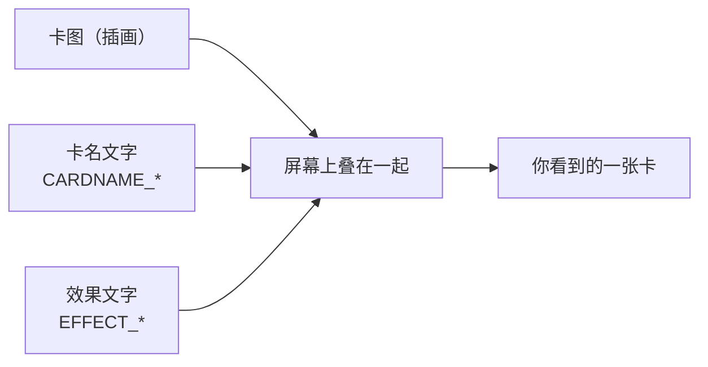
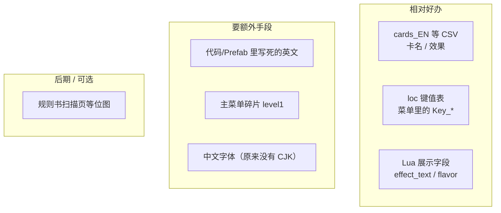
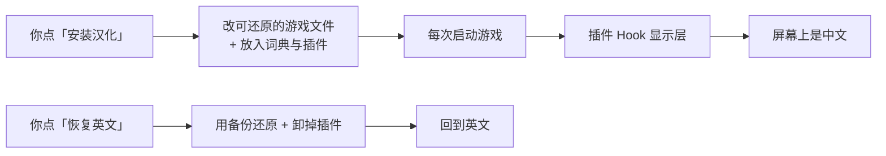
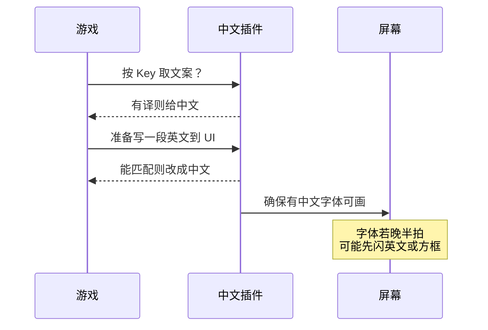
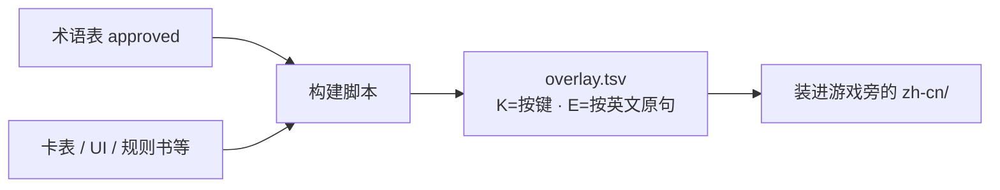
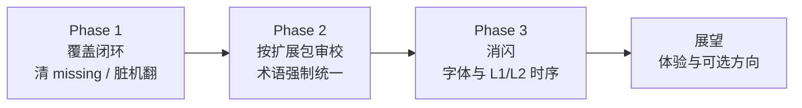

# 为什么《Ascension》能做成中文？——粉丝汉化补丁背后的一点原理

> 写给想玩中文、又对「游戏怎么被翻译」好奇的玩家。技术细节见 [系统设计](architecture.zh.md)；进度见 [progress.zh.md](progress.zh.md)。

Steam 上的 *Ascension: Deckbuilding Game*（Unity + IL2CPP）官方界面只有英语。它在中文圈里有两个名字：**《暗杀神》**（早期方盒子引进）和 **《创升纪元》**（后来系列正式名）。下面说的「汉化」，指的是玩家自用的**外置、可开关语言包**——不是官方 DLC，也不分发游戏本体或卡图。

很多人会问：**这种现代 Unity 游戏，为什么还能做成中文？**  
答案可以压成一句话：

**因为游戏自己就有一条「取词 → 叠字显示」的本地化管线；卡面上的英文大多不是烤在图里的，而是运行时叠上去的字。我们只是接上中文词典，并补上中文字体。**

---

## 1. 先打破一个误解：卡面不是「画上去的英文」

若英文是整张烤进贴图的艺术字，粉丝几乎只能重绘——那是另一条难得多的路。

《Ascension》的卡面更像这样：

插画是图；**名字和效果是 TextMeshPro 动态叠字**（英文里还常见首字母放大，比如把 `V` 单独加大）。  
所以汉化时，我们改的是「叠上去的那串字」，不必重画整张卡。

规则书里有一部分是**扫描位图**（整页是图），那种目前刻意不做，标成 waived；能改的是文字段。

---

## 2. 游戏里的字，其实散落在好几处

可以把它想成一家餐厅的菜单：有的写在白板（资源表），有的写在后厨小抄（Lua），有的写在墙上贴纸（硬编码 UI）。

更有利的一点：上游语言表里已经留了 **CH（中文）列**，只是**整列是空的**。  
这不等于「点一下语言就有中文」——空列 + 没有中文字体 = 要么仍是英文，要么方框。所以补丁仍然要自带词库和字体，并提供自己的开关。

还有一条红线：**Lua 里的 `card_name` 是内部 ID**（联机和逻辑会用到），只改给人看的 `display_name` / `effect_text` / `flavor_text`，绝不改 ID。

---

## 3. 整体思路：一半写进磁盘，一半在运行时「拦一句换一句」

补丁是**混合方案**，用大白话说：

| 做法 | 像什么 | 干什么 |
| --- | --- | --- |
| **离线补丁** | 安装时把菜单上能安全改的菜名片换掉（并备份） | Lua 展示字段、部分资源表、少量主菜单串 |
| **运行时插件** | 服务员上菜前再看一眼中英对照表 | 按键取词、硬编码英文替换、挂中文字体 |
| **术语表** | 厨房统一用料名 | `glossary` 保证「Rune」不会一会儿叫符文一会儿叫符石 |

Steam「验证游戏文件完整性」会把离线改动拆掉，需要再装一次汉化——这是可还原设计的代价，也是刻意不做「永久劫持安装目录」的原因。

---

## 4. 运行时：两道关卡 + 一块「中文招牌」

插件跑在 **BepInEx** 上（Unity IL2CPP 常用的外置注入框架）。玩家可以把它理解成：

1. **第一道关（L1）**：游戏问「这个 Key 对应什么文案？」——我们若有中文，就直接交中文。  
2. **第二道关（L2）**：有些字根本不走 Key，是代码里写死的英文——在真正画到屏幕前，用英文字面去查对照表。  
3. **字体**：原版 TMP 几乎只有拉丁字形。没有中文字体时，就算词库对了，你也会看到一排「口口口」（tofu）。所以要挂雅黑/黑体或自带的 CJK 回退字体。

回合提示一类文案比较特殊：游戏逻辑每帧用**英文**去比较状态（例如是不是「你的回合」）。插件的策略是：**给人看中文，给逻辑读回英文**，有时会换来「先英后中」闪一帧——这是已知体验债，后面会专门消闪。

教程里带 `CLICK` / 可点链接的句子，故意不乱改，避免点选热区坏掉。

---

## 5. 词从哪里来：一张术语表当「唯一真相」

汉化最怕同词多译。补丁把 **`glossary/zh-Hans.csv` 当作 SSOT（唯一事实来源）**：审过的词才进发布用的 `overlay.tsv`。

构建可以粗画成：

文案优先级也很直白：

1. 官方实体中文（《暗杀神》/《创升纪元》）  
2. 民间已固化的主流译法  
3. 缺口再按统一术语新译  

公开分发时只带译表、工具、字体说明和开关器——**不分发游戏、卡图、规则书扫描件**。

---

## 6. 现在走到哪了？

截至文档撰写时（可与 [进度](progress.zh.md) 对照）：

| 已经大致能玩 | 仍在打磨 |
| --- | --- |
| 菜单、卡名、效果大部分中文 | 部分卡效仍是机翻 draft，要按扩展包审校 |
| 图鉴 Lua 展示字段可改写 | Inventory 里还有 `missing`（多为空风味等）要清零 |
| 规则书**文字段**与 DLC 商店长文已灌入译表 | 「先英后中」闪烁、字体时序 |
| 一键安装 / 恢复英文 | 位图标题（如部分 Logo）暂不重绘 |
| pytest + 覆盖矩阵防「修一处坏一处」 | 繁体完整产品化延后 |

数量级感受：运行时词库大约有三千级 Key、两千级 Exact 匹配——够覆盖日常对局与大部分界面，但「无遗漏」仍靠 Inventory 一张张勾。

---

## 7. 接下来要做什么（路线图）

**Phase 1 — 覆盖闭环**  
把 Inventory 发布域里的 `missing` 压到 0；清掉不应进主表的机翻碎片；空风味、残留英文卡效逐项收口。

**Phase 2 — 按包审校**  
把 `draft` 推到 `reviewed`；强制统一历史口径（例如派系译名与实体牌对齐），避免「同一套牌两种叫法」。

**Phase 3 — 消闪**  
让中文字体更早就绪、扩大走 Key 的路径、减少事后改写——目标是打开菜单和进战斗时少闪英文、少闪方框。

**刻意靠后或不做的：**

- 重绘位图艺术字 / 规则书扫描页（工作量与版权边界都不同）  
- 改内部 `card_name`  
- 把「点官方空白 CH」当成唯一开关（可作为很远期的收敛方向，现在不依赖）

---

## 8. 展望

近处：让「能玩的中文」变成「审过的中文」，再变成「看起来就很稳的中文」。

稍远处：

- **质量**：金样快照 + 人工 UX 清单，发版前少踩回归坑  
- **体验**：消闪、教程与商店长文的边角  
- **可选**：繁体（可用转换再加关键字人工）；评估是否更深入接官方 CH 列（仍要字体与词库）  
- **社区**：术语表可审、补丁可关——方便玩家反馈「这张卡民间一直叫××」

若只能记住三件事：

1. **能汉化，是因为字多半是叠上去的，不是烤在图上的。**  
2. **做法是：磁盘上能安全改的改掉 + 运行时查表改写 + 挂中文字体。**  
3. **接下来重点是审校、无遗漏和消闪，而不是再发明一套注入方式。**

---

## 想自己装 / 想读更深

- 安装：[仓库 README](../README.zh.md)  
- 原理细账：[architecture.zh.md](architecture.zh.md)（含更多架构图）  
- 术语怎么维护：[GLOSSARY.zh.md](GLOSSARY.zh.md)  
- 可行性与版权边界：[feasibility-report.zh.md](feasibility-report.zh.md)

*本文介绍粉丝语言包的技术思路，与 Playdek / Stone Blade 及各中文出版社无官方隶属关系。玩得开心。*
