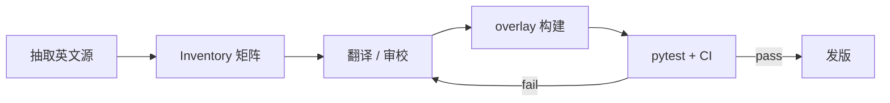

# 《创升纪元》汉化路线图

- English: [roadmap.md](roadmap.md)
- 关联：[系统设计](architecture.zh.md) · [进度](progress.zh.md)

本文是仓库的**执行计划 SSOT**：缺陷诊断结论、硬原则、分阶段 Exit，以及与 Inventory / pytest 的绑定关系。

---

## 1. 硬原则（所有阶段必须遵守）

### 原则 1：测试防回归

- 任何修译、改插件、改构建脚本：**先有可自动跑的断言，再改代码/词库**。
- 本地：`python -m pytest -q`；CI（`.github/workflows/build.yml`）同门禁。
- 工作流：**失败用例 → 改词库/插件 → 全绿才能合**。

### 原则 2：库存驱动、无遗漏

- 用 Inventory 登记全部可显示文案域；状态 ∈ `{missing | draft | reviewed | waived}`。
- `waived` 必须写原因（位图标题、教程热区、协议 ID 等），**禁止静默跳过**。
- 发布域内目标：**`missing = 0`**（`waived` 公示，不算遗漏）。
- 英文源增多而矩阵未增 → CI 失败。

---

## 2. 架构结论（现状）

三层混合，**不是**原生 CH 语言包：

| 层 | 内容 |
| --- | --- |
| 离线 | Lua 展示字段 / `resources.assets` / `level1` 等长替换 |
| 词库 | glossary SSOT → `loc/zh-Hans/overlay.tsv` |
| 运行时 | BepInEx IL2CPP：`GetTextByKey`（L1）+ TMP/UI `set_text` Exact/Norm（L2）+ 雅黑 CJK fallback |

已知体验问题（闪烁、双源不一致、商店长文匹配）由此而来；缓解策略见系统设计 §缺陷与演进，以及插件变更记录。

---

## 3. 测试分层

| 层 | 内容 | 时机 |
| --- | --- | --- |
| L0 | overlay / TSV 构建不变量 | 每次 PR |
| L1 | Inventory 覆盖与 `gates.json` 天花板 | 每次 PR |
| L2 | glossary 禁词 / 必词 | 每次 PR |
| L3 | 归一化、去标签等纯函数 | 每次 PR |
| L4 | 金样英文→中文快照 | 每次 PR |
| L5 | enable/disable 安装烟雾 | 发版前 |
| L6 | 人工 UX（商店/规则书/消闪） | 发版前 |

---

## 4. Inventory 文案域

| domain | 完成定义（Exit） |
| --- | --- |
| `ui_keys` / `ui_runtime` | 无机器垃圾；目标域 missing=0 |
| `tutorial` | 已基本完成；锁回归 |
| `cards_name` / `cards_effect` / `cards_flavor` | 无纯英文 effect；flavor 可后置但不得静默缺登记 |
| `combat_log` | 小集合锁死 |
| `rulebook_text` / `shop_dlc` | 段落非 missing；credits 可 waived |
| `bitmap_title` / `tutorial_hotspot` / `protocol_id` | **waived** 并公示原因 |

生成：`python tools/inventory_build.py` → `loc/inventory/strings.csv` + `summary.json`；天花板：`gates.json`。

---

## 5. 分阶段 Roadmap

### Phase T — 测试与库存地基

- Inventory 矩阵 + `inventory_build.py`
- pytest L0–L4 + CI
- 基线天花板写入 `gates.json`（不得无故恶化）

**Exit：** `pytest` 绿；全部 domain 已登记；waived 有原因。

### Phase 0 — 基线修复（高 ROI）

- 灌入 `rulebook.csv` 已有人工稿 → 重建 overlay
- 清理 `ui_runtime` 已知垃圾
- 金样：UI / DLC 描述 / 规则书片段
- 运行时热修（与商店/规则书可用性绑定，详见进度 changelog）：
  - 禁止 hook 全部 `SetText(string, float…)` 格式化重载（商店卡死）
  - 部署完整 overlay（禁止安装器回退到截短表）
  - 长文 normalize：标签替换为空格；Exact + NormalizedExact；必要时分段 partial

**Exit：** 规则书/商店长文可显示中文；商店不卡死；相关门禁收紧；pytest 绿。

### Phase 1 — 覆盖闭环（`missing → 0`）

按域关闭，一次只收紧一个域的严格门禁：

1. 确认 `shop_dlc` + `rulebook_text` 维持 missing=0
2. Lua / 卡效纯英文残留清零（质量可为 draft）
3. `ui_runtime` / 短 UI 漏译
4. `cards_flavor` 空壳：翻译或显式 waived（不得 silent）
5. `cards_name` 剩余 missing

**Exit：** 目标域 `missing=0`；`gates.json` 的 `max_missing_*` 同步下调；ingest 不得把机翻标成 reviewed。

### Phase 2 — 质量（`draft → reviewed`）

按扩展包审校（包序固定，避免漏包）：

`CotG → CotG10 → RotF → SoS → IH → RoV → DU → RU → DoC → DS → WoS → GotE → VotA → Del → Dlvr → LGND → promo`

每包 Exit：glossary 门禁通过（如 Enlightened→圣贤，禁「启迪」）；该包 effect 全为 `reviewed`（flavor 可仍 draft 但计数可见）。

### Phase 3 — UX 消闪

- 字体 / L2 时序、扩大 L1、规则书面板定向重本地化、评估原生 CH
- **每项改动**必须带回归用例或文档化 L6 清单项

**Exit：** L6 清单勾选；无覆盖率回退。

---

## 6. 运行时稳定性备忘（商店 / 规则书）

| 做法 | 原因 |
| --- | --- |
| 不 patch `SetText` 的 float 格式化重载 | IAP 商店填充时主线程卡死 |
| 可尝试仅 `SetText(string)` prefix；失败则依赖 `set_text` + Relocalize | IL2CPP 上 prefix 可能 Compile Error |
| 长文 Relocalize：未激活长文跳过；短菜单未激活仍改 | 菜单晚激活 vs 商店休眠 TMP |
| overlay 部署后校验字节数（≳400KB） | 截短 payload 会导致 exact≈988、长文全英 |
| DumpUntranslated / 长文诊断默认关 | 磁盘 I/O 可拖死 UI |

---

## 7. 变更记录

| 日期 | 说明 |
| --- | --- |
| 2026-08-22 | 首版：将缺陷分析计划落库；标注 Phase T/0 完成与 Phase 1 入口 |
